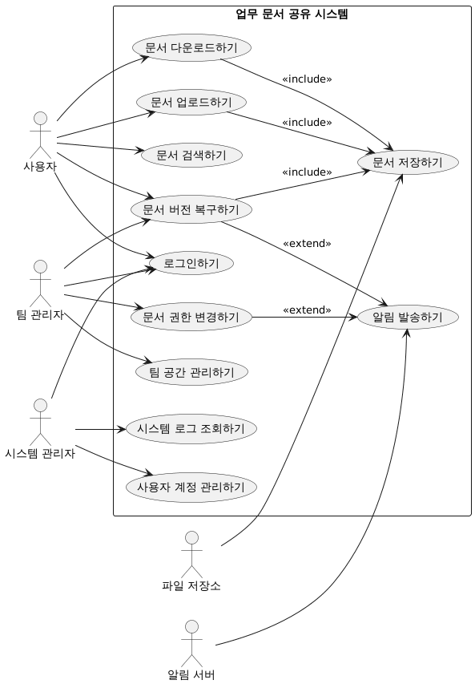
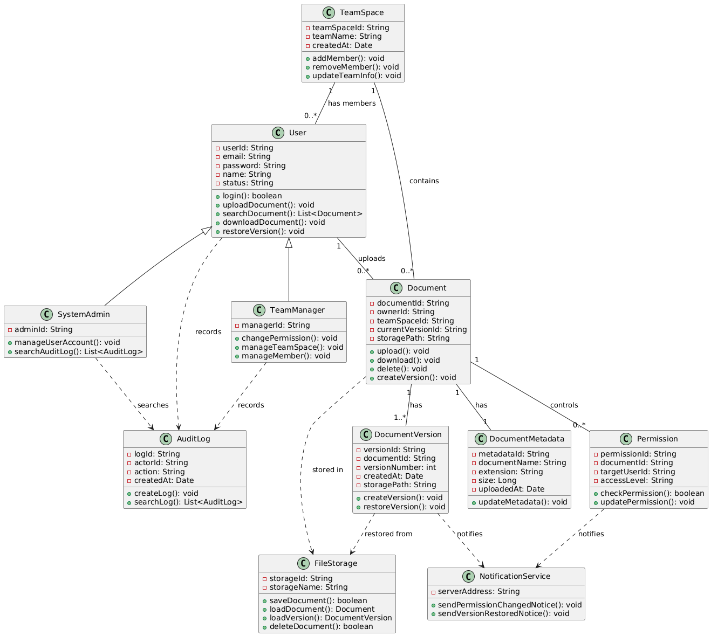
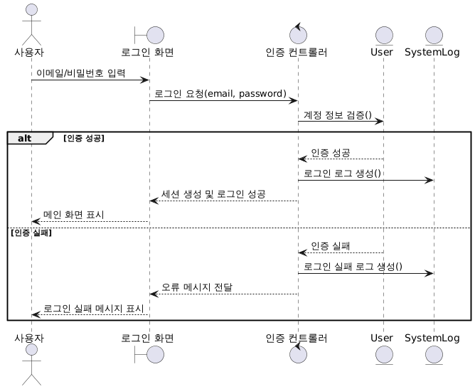
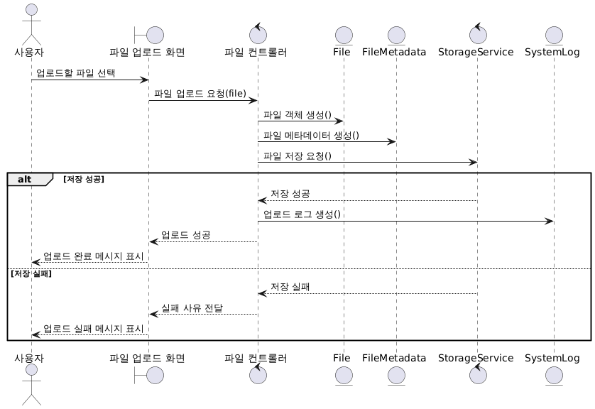

# 요구사항 분석서

## 0. 서론

### 0.1 문서의 목적

이 문서는 클라우드 기반 파일 공유 시스템의 요구사항을 객체지향 분석 관점에서 정리하기 위한 문서이다. 시스템의 주요 기능을 유스케이스로 도출하고, 클래스 다이어그램, CRC 카드, 순차 다이어그램, 요구사항 추적표를 통해 기능·구조·행위 관점에서 분석한다.

### 0.2 시스템의 범위

본 시스템은 사용자가 파일을 업로드, 다운로드, 검색, 공유, 삭제할 수 있도록 지원한다. 또한 공유 링크와 접근 권한을 통해 파일 접근을 제어하고, 관리자는 사용자 계정과 시스템 로그를 관리할 수 있다.

본 문서의 분석 범위는 다음과 같다.

- 사용자 로그인
- 파일 업로드 및 다운로드
- 파일 검색
- 파일 공유 및 외부 공유 링크 다운로드
- 파일 삭제
- 사용자 관리
- 시스템 로그 확인
- 요구사항과 분석 산출물 간 일관성 점검

## 1. 기능 관점 — 유스 케이스

### 1.1 유스 케이스 다이어그램

### 1.2 유스 케이스 설명서

#### UC-01 로그인

| 항목 | 내용 |
|---|---|
| 유스케이스명 | 로그인 |
| 행위자 | 사용자 |
| 사전 조건 | 사용자는 회원가입이 완료된 상태여야 한다. |
| 기본 흐름 | 1. 사용자가 이메일과 비밀번호를 입력한다. 2. 시스템이 입력된 계정 정보를 검증한다. 3. 인증에 성공하면 시스템이 사용자 세션을 생성한다. 4. 시스템이 메인 화면을 표시한다. |
| 예외 흐름 | 이메일 또는 비밀번호가 일치하지 않으면 오류 메시지를 표시한다. 정지된 계정이면 이용 제한 메시지를 표시한다. |
| 사후 조건 | 사용자 세션이 생성되고 파일 목록 화면으로 이동한다. |

#### UC-02 파일 업로드

| 항목 | 내용 |
|---|---|
| 유스케이스명 | 파일 업로드 |
| 행위자 | 사용자 |
| 사전 조건 | 사용자는 로그인되어 있어야 한다. |
| 기본 흐름 | 1. 사용자가 업로드할 파일을 선택한다. 2. 시스템이 파일 크기와 확장자를 검사한다. 3. 시스템이 파일을 클라우드 저장소에 저장한다. 4. 시스템이 파일 메타데이터를 저장한다. 5. 시스템이 업로드 완료 메시지를 표시한다. |
| 예외 흐름 | 파일 크기가 제한을 초과하면 업로드를 거부한다. 허용되지 않는 확장자이면 업로드를 거부한다. 저장소 오류가 발생하면 실패 메시지를 표시한다. |
| 사후 조건 | 파일과 파일 메타데이터가 시스템에 저장된다. |

#### UC-03 파일 다운로드

| 항목 | 내용 |
|---|---|
| 유스케이스명 | 파일 다운로드 |
| 행위자 | 사용자 |
| 사전 조건 | 사용자는 로그인되어 있어야 하며, 파일에 대한 접근 권한이 있어야 한다. |
| 기본 흐름 | 1. 사용자가 다운로드할 파일을 선택한다. 2. 시스템이 파일 존재 여부를 확인한다. 3. 시스템이 사용자의 접근 권한을 확인한다. 4. 시스템이 클라우드 저장소에서 파일을 불러온다. 5. 시스템이 사용자에게 파일을 제공한다. |
| 예외 흐름 | 파일이 존재하지 않으면 파일 없음 메시지를 표시한다. 접근 권한이 없으면 다운로드를 거부한다. 저장소 연결에 실패하면 다운로드 실패 메시지를 표시한다. |
| 사후 조건 | 사용자가 파일을 다운로드한다. |

#### UC-04 파일 공유

| 항목 | 내용 |
|---|---|
| 유스케이스명 | 파일 공유 |
| 행위자 | 사용자 |
| 사전 조건 | 사용자는 로그인되어 있어야 하며, 공유할 파일의 소유자이거나 공유 권한을 가지고 있어야 한다. |
| 기본 흐름 | 1. 사용자가 공유할 파일을 선택한다. 2. 사용자가 공유 방식과 접근 권한을 설정한다. 3. 시스템이 공유 링크를 생성한다. 4. 시스템이 공유 정보를 저장한다. 5. 사용자가 공유 링크를 확인한다. |
| 예외 흐름 | 파일이 존재하지 않으면 공유를 중단한다. 권한 설정이 누락되면 권한 설정 필요 메시지를 표시한다. 링크 생성에 실패하면 공유 실패 메시지를 표시한다. |
| 사후 조건 | 공유 링크와 접근 권한 정보가 생성된다. |

#### UC-05 외부 공유 링크 다운로드

| 항목 | 내용 |
|---|---|
| 유스케이스명 | 외부 공유 링크 다운로드 |
| 행위자 | 외부 접근자 |
| 사전 조건 | 외부 접근자는 유효한 공유 링크를 가지고 있어야 한다. |
| 기본 흐름 | 1. 외부 접근자가 공유 링크에 접속한다. 2. 시스템이 공유 링크의 유효성을 확인한다. 3. 시스템이 링크 만료 여부와 접근 권한을 확인한다. 4. 시스템이 클라우드 저장소에서 파일을 불러온다. 5. 시스템이 외부 접근자에게 파일을 제공한다. |
| 예외 흐름 | 링크가 만료되었으면 접근을 거부한다. 비활성화된 링크이면 다운로드를 거부한다. 파일이 삭제되었으면 파일 없음 메시지를 표시한다. |
| 사후 조건 | 외부 접근자가 공유된 파일을 다운로드한다. |

#### UC-06 파일 검색

| 항목 | 내용 |
|---|---|
| 유스케이스명 | 파일 검색 |
| 행위자 | 사용자 |
| 사전 조건 | 사용자는 로그인되어 있어야 한다. |
| 기본 흐름 | 1. 사용자가 검색어 또는 검색 조건을 입력한다. 2. 시스템이 사용자가 접근 가능한 파일 범위에서 검색한다. 3. 시스템이 검색 결과를 표시한다. |
| 예외 흐름 | 검색 결과가 없으면 결과 없음 메시지를 표시한다. |
| 사후 조건 | 사용자가 조건에 맞는 파일 목록을 확인한다. |

#### UC-07 파일 삭제

| 항목 | 내용 |
|---|---|
| 유스케이스명 | 파일 삭제 |
| 행위자 | 사용자, 관리자 |
| 사전 조건 | 사용자는 본인 파일에 접근 가능해야 하며, 관리자는 관리자 권한을 가지고 있어야 한다. |
| 기본 흐름 | 1. 사용자 또는 관리자가 삭제할 파일을 선택한다. 2. 시스템이 삭제 권한을 확인한다. 3. 시스템이 클라우드 저장소에서 파일을 삭제한다. 4. 시스템이 파일 메타데이터를 삭제 상태로 변경한다. 5. 시스템이 삭제 완료 메시지를 표시한다. |
| 예외 흐름 | 삭제 권한이 없으면 삭제를 거부한다. 저장소 삭제에 실패하면 실패 메시지를 표시한다. |
| 사후 조건 | 파일이 삭제되거나 삭제 상태로 변경된다. |

#### UC-08 사용자 관리

| 항목 | 내용 |
|---|---|
| 유스케이스명 | 사용자 관리 |
| 행위자 | 관리자 |
| 사전 조건 | 관리자는 로그인되어 있어야 한다. |
| 기본 흐름 | 1. 관리자가 사용자 관리 메뉴를 선택한다. 2. 시스템이 사용자 목록을 표시한다. 3. 관리자가 특정 사용자를 선택한다. 4. 관리자가 계정 정지 또는 삭제를 수행한다. 5. 시스템이 사용자 상태를 변경한다. |
| 예외 흐름 | 관리 권한이 없으면 처리를 거부한다. 대상 사용자가 존재하지 않으면 오류 메시지를 표시한다. |
| 사후 조건 | 사용자 계정 상태가 변경된다. |

#### UC-09 시스템 로그 확인

| 항목 | 내용 |
|---|---|
| 유스케이스명 | 시스템 로그 확인 |
| 행위자 | 관리자 |
| 사전 조건 | 관리자는 로그인되어 있어야 한다. |
| 기본 흐름 | 1. 관리자가 로그 확인 메뉴를 선택한다. 2. 관리자가 검색 조건을 입력한다. 3. 시스템이 조건에 맞는 로그를 조회한다. 4. 시스템이 로그 목록을 표시한다. |
| 예외 흐름 | 검색 결과가 없으면 로그 없음 메시지를 표시한다. |
| 사후 조건 | 관리자가 시스템 사용 기록을 확인한다. |

---

## 2. 구조 관점 — 클래스 다이어그램

### 2.1 클래스 다이어그램

### 2.2 주요 클래스 설명

| 클래스 | 설명 |
|---|---|
| User | 파일 공유 시스템을 이용하는 일반 사용자 |
| Admin | 사용자와 파일을 관리하는 관리자 |
| File | 사용자가 업로드한 파일 |
| FileMetadata | 파일명, 크기, 확장자, 업로드 일시 등 파일 부가 정보 |
| Folder | 사용자가 파일을 분류하기 위해 생성하는 폴더 |
| ShareLink | 파일 공유를 위해 생성되는 링크 |
| Permission | 파일 또는 공유 링크에 대한 접근 권한 |
| StorageService | 클라우드 저장소와 연동하여 파일 저장, 조회, 삭제를 수행하는 외부 서비스 |
| SystemLog | 로그인, 업로드, 다운로드, 삭제 등 주요 행위를 기록하는 로그 |

### 2.3 CRC 카드

#### CRC-01 User

| 항목 | 내용 |
|---|---|
| Class Name | User |
| Type | Concrete, Domain |
| Description | 파일 공유 시스템을 사용하는 일반 회원이다. |
| Associated Use Case | UC-01, UC-02, UC-03, UC-04, UC-06, UC-07 |

| Responsibilities | Collaborators |
|---|---|
| 로그인 요청 | SystemLog |
| 파일 업로드 요청 | File, StorageService |
| 파일 다운로드 요청 | File, Permission, StorageService |
| 파일 검색 요청 | File |
| 파일 공유 요청 | ShareLink, Permission |
| 파일 삭제 요청 | File |

#### CRC-02 Admin

| 항목 | 내용 |
|---|---|
| Class Name | Admin |
| Type | Concrete, Domain |
| Description | 시스템 운영과 관리를 담당하는 관리자이다. |
| Associated Use Case | UC-07, UC-08, UC-09 |

| Responsibilities | Collaborators |
|---|---|
| 사용자 계정 관리 | User |
| 부적절한 파일 삭제 | File |
| 시스템 로그 확인 | SystemLog |

#### CRC-03 File

| 항목 | 내용 |
|---|---|
| Class Name | File |
| Type | Concrete, Domain |
| Description | 사용자가 업로드한 파일을 나타낸다. |
| Associated Use Case | UC-02, UC-03, UC-04, UC-05, UC-06, UC-07 |

| Responsibilities | Collaborators |
|---|---|
| 파일 업로드 처리 | User, StorageService |
| 파일 다운로드 처리 | User, StorageService |
| 파일 삭제 처리 | User, Admin, StorageService |
| 파일 정보 관리 | FileMetadata |
| 공유 링크 생성 요청 | ShareLink |

#### CRC-04 FileMetadata

| 항목 | 내용 |
|---|---|
| Class Name | FileMetadata |
| Type | Concrete, Domain |
| Description | 파일의 부가 정보를 저장한다. |
| Associated Use Case | UC-02, UC-06 |

| Responsibilities | Collaborators |
|---|---|
| 파일명 저장 | File |
| 파일 크기 저장 | File |
| 파일 확장자 저장 | File |
| 업로드 일시 저장 | File |
| 검색 조건 제공 | User |

#### CRC-05 Folder

| 항목 | 내용 |
|---|---|
| Class Name | Folder |
| Type | Concrete, Domain |
| Description | 사용자가 파일을 분류하기 위해 생성하는 폴더이다. |
| Associated Use Case | UC-02, UC-06, UC-07 |

| Responsibilities | Collaborators |
|---|---|
| 폴더 생성 | User |
| 폴더명 변경 | User |
| 폴더 삭제 | User |
| 파일 분류 | File |

#### CRC-06 ShareLink

| 항목 | 내용 |
|---|---|
| Class Name | ShareLink |
| Type | Concrete, Domain |
| Description | 파일 공유를 위해 생성되는 외부 접근 링크이다. |
| Associated Use Case | UC-04, UC-05 |

| Responsibilities | Collaborators |
|---|---|
| 공유 링크 생성 | File |
| 링크 만료 시간 관리 | Permission |
| 링크 활성 상태 확인 | Permission |
| 외부 다운로드 요청 처리 | StorageService |

#### CRC-07 Permission

| 항목 | 내용 |
|---|---|
| Class Name | Permission |
| Type | Concrete, Domain |
| Description | 파일 접근 권한과 공유 권한을 나타낸다. |
| Associated Use Case | UC-03, UC-04, UC-05 |

| Responsibilities | Collaborators |
|---|---|
| 접근 권한 확인 | User, File |
| 공유 권한 설정 | ShareLink |
| 다운로드 가능 여부 판단 | File |

#### CRC-08 StorageService

| 항목 | 내용 |
|---|---|
| Class Name | StorageService |
| Type | Concrete, External |
| Description | 클라우드 저장소와 연동하여 파일을 저장하고 불러온다. |
| Associated Use Case | UC-02, UC-03, UC-05, UC-07 |

| Responsibilities | Collaborators |
|---|---|
| 파일 저장 | File |
| 파일 불러오기 | File |
| 파일 삭제 | File |

#### CRC-09 SystemLog

| 항목 | 내용 |
|---|---|
| Class Name | SystemLog |
| Type | Concrete, Domain |
| Description | 시스템에서 발생한 주요 행위를 기록한다. |
| Associated Use Case | UC-01, UC-02, UC-03, UC-07, UC-09 |

| Responsibilities | Collaborators |
|---|---|
| 로그인 로그 기록 | User |
| 업로드 로그 기록 | File |
| 다운로드 로그 기록 | File |
| 삭제 로그 기록 | User, Admin |
| 로그 조회 | Admin |

---

## 3. 행위 관점 — 순차 다이어그램

### 3.1 로그인

### 3.2 파일 업로드

### 3.3 외부 공유 링크 다운로드

---

## 4. 요구사항 추적표

| 요구사항 ID | 요구사항 내용 | 관련 유스케이스 |
|---|---|---|
| FR-01 | 사용자는 로그인할 수 있어야 한다. | UC-01 |
| FR-02 | 사용자는 파일을 업로드할 수 있어야 한다. | UC-02 |
| FR-03 | 시스템은 업로드된 파일을 클라우드 저장소에 저장해야 한다. | UC-02 |
| FR-04 | 사용자는 파일을 다운로드할 수 있어야 한다. | UC-03 |
| FR-05 | 사용자는 파일 공유 링크를 생성할 수 있어야 한다. | UC-04 |
| FR-06 | 외부 접근자는 유효한 공유 링크로 파일을 다운로드할 수 있어야 한다. | UC-05 |
| FR-07 | 사용자는 파일명, 확장자, 업로드 날짜로 파일을 검색할 수 있어야 한다. | UC-06 |
| FR-08 | 사용자는 본인이 업로드한 파일을 삭제할 수 있어야 한다. | UC-07 |
| FR-09 | 관리자는 사용자 계정을 관리할 수 있어야 한다. | UC-08 |
| FR-10 | 관리자는 시스템 로그를 확인할 수 있어야 한다. | UC-09 |
| NFR-01 | 시스템은 권한이 없는 사용자의 파일 접근을 제한해야 한다. | UC-03, UC-04, UC-05 |
| NFR-02 | 시스템은 파일 업로드, 다운로드, 삭제 행위를 로그로 기록해야 한다. | UC-02, UC-03, UC-07, UC-09 |
| NFR-03 | 시스템은 파일 검색 결과를 일정 시간 내에 제공해야 한다. | UC-06 |

---

## 5. 인터페이스 분석

| 인터페이스 | 설명 |
|---|---|
| 사용자 화면 | 로그인, 파일 목록, 업로드, 다운로드, 검색, 공유, 삭제 기능을 제공한다. |
| 관리자 화면 | 사용자 관리, 파일 관리, 시스템 로그 확인 기능을 제공한다. |
| 클라우드 저장소 인터페이스 | 파일 저장, 조회, 삭제 요청을 처리한다. |
| 데이터베이스 인터페이스 | 사용자, 파일 메타데이터, 권한, 로그 정보를 저장한다. |

---

## 6. 제약사항

| 구분 | 제약사항 |
|---|---|
| 보안 | 권한이 없는 사용자는 파일에 접근할 수 없어야 한다. |
| 보안 | 공유 링크는 만료 시간과 활성 상태를 가져야 하며, 기본 만료 시간은 7일로 설정한다. |
| 저장소 | 파일은 클라우드 저장소에 저장되어야 한다. |
| 파일 제한 | 업로드 가능한 파일 크기는 1개당 최대 100MB로 제한한다. |
| 파일 제한 | exe, bat, sh 등 실행 파일 형식은 업로드할 수 없다. |
| 로그 | 로그인, 업로드, 다운로드, 삭제 등 주요 행위는 로그로 기록되어야 한다. |
| 성능 | 파일 검색은 일반적인 상황에서 3초 이내에 결과를 제공해야 한다. |
| 가용성 | 클라우드 저장소 오류 발생 시 사용자에게 실패 사유를 안내해야 한다. |
---

## 7. 산출물 간 일관성 점검

| 점검 항목 | 점검 결과 |
|---|---|
| 유스케이스 설명서의 주요 명사가 클래스 후보로 도출되었는가 | User, Admin, File, ShareLink, Permission, StorageService, SystemLog가 클래스 다이어그램에 반영되었다. |
| 각 클래스가 하나 이상의 유스케이스와 연결되어 있는가 | CRC 카드에 Associated Use Case를 명시하였다. |
| 주요 유스케이스가 순차 다이어그램으로 표현되었는가 | 로그인, 파일 업로드, 외부 공유 링크 다운로드를 순차 다이어그램으로 작성하였다. |
| 순차 다이어그램의 객체가 클래스 다이어그램에 존재하는가 | User, File, Permission, ShareLink, StorageService, SystemLog가 클래스 다이어그램에 존재한다. |
| 순차 다이어그램의 메시지가 클래스의 책임과 일치하는가 | 로그인, 저장, 권한 확인, 파일 반환 등의 메시지가 CRC 카드의 책임과 연결된다. |
